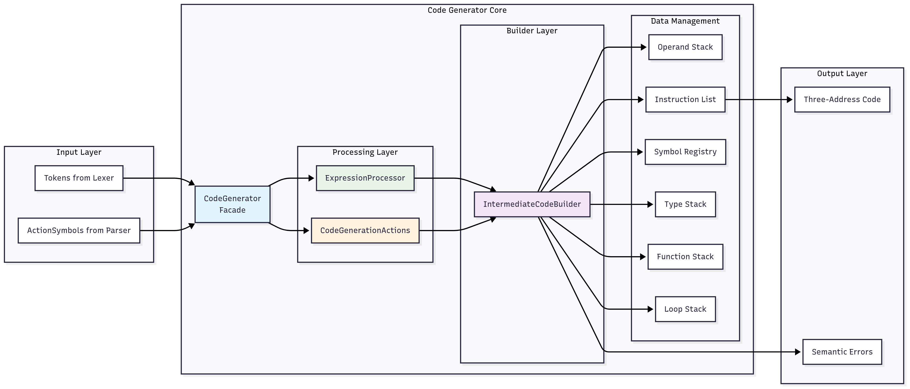

# Intermediate Code Generator

**Author:** Sepehr Vahedi  
**Student ID:** 99170615

## Overview

The Intermediate Code Generator is a crucial component of a compiler that transforms parsed source code into an intermediate representation (three-address code). This module bridges the gap between high-level language constructs and low-level machine instructions, providing a platform-independent intermediate form that can be easily optimized and translated to target machine code.

## Architecture

The system follows a modular, component-based architecture with three main classes working together:



## Core Components

### 1. IntermediateCodeBuilder (`intermediate_code_builder.py`)

**Purpose:** The central engine that manages the intermediate code generation process.

**Key Responsibilities:**
- **Operand Stack Management**: Maintains a stack of operands and intermediate results during expression evaluation
- **Instruction Generation**: Builds a list of three-address code instructions
- **Memory Management**: Handles temporary variable allocation starting from address 508
- **Symbol Registry Integration**: Interfaces with the symbol table for identifier resolution
- **Type Tracking**: Maintains a stack to track data types for semantic analysis
- **Function Call Stack**: Manages nested function calls and parameter passing
- **Loop Context**: Tracks loop structures for break statement handling

**Key Data Structures:**
```python
self.operand_stack = []           # Stack for expression operands
self.instruction_list = ['']      # Generated three-address instructions
self.data_type_stack = []         # Type information stack
self.function_stack = []          # Active function contexts
self.loop_stack = []              # Active loop contexts
self.temporary_counter = 508      # Next available temp address
```

**Core Methods:**
- `allocate_temporary()`: Assigns unique memory addresses for temporary variables
- `handle_function_result()`: Manages function return values stored at @1000
- `validate_semantics()`: Performs semantic checks (type compatibility, scope validation, etc.)

### 2. CodeGenerationActions (`code_generation_actions.py`)

**Purpose:** Handles code generation for language constructs and control structures.

**Action Categories:**

#### Declaration Actions
- **SET_DECLARING**: Activates declaration mode in symbol table
- **PUSH**: Pushes token lexemes onto operand stack
- **UPDATE_TYPE**: Updates symbol types in the symbol table
- **UPDATE_VAR_ATTRIBUTES**: Finalizes variable declarations with memory initialization
- **UPDATE_ARR_ATTRIBUTES**: Handles array declarations with size-based memory allocation

#### Scope Management
- **START_SCOPE/END_SCOPE**: Manages lexical scoping for variables
- **START_FUNCTION**: Initiates function scope with parameter declaration mode

#### Function Management
- **UPDATE_FUNC_ATTRIBUTES**: Finalizes function declarations, handles main function special case
- **RETURN_AT_THE_END_OF_FUNCTION**: Generates function epilogue code

#### Control Flow
- **LABEL/SAVE**: Marks instruction positions for jumps
- **WHILE_SAVE/WHILE**: Generates loop entry and exit code
- **JPF/JP/JPF_SAVE**: Conditional and unconditional jump generation
- **BREAK**: Generates break statement jumps

### 3. ExpressionProcessor (`expression_processor.py`)

**Purpose:** Handles expression evaluation, operations, and function calls.

**Processing Categories:**

#### Identifier Processing
- **PUSH_ID**: Resolves identifiers to addresses, handles function references
- Special handling for built-in `output` function
- Function call setup with parameter stack management

#### Operation Processing
- **ASSIGN**: Generates assignment instructions with function result handling
- **OPERATION**: Handles arithmetic (+, -, *, /) and comparison (<, ==) operations
- **NEG**: Implements unary minus through multiplication by -1
- **UPDATE_ID**: Array indexing with bounds calculation (index * 4 + base)

#### Function Call Processing
- **NEW_ARG**: Manages parameter passing for function calls
- **CALL**: Generates complete function call sequence including:
    - Stack frame setup
    - Parameter copying
    - Return address saving
    - Jump to function
    - Stack cleanup

#### Literal and Utility Processing
- **SAVE_NUM**: Handles numeric literals with immediate addressing (#value)
- **POP**: Cleans up operand stack with special handling for function returns
- **RETURN/RETURN_VALUE**: Generates function return sequences

## Three-Address Code Format

The generator produces instructions in the format: `(OPERATION, ARG1, ARG2, RESULT)`

**Address Types:**
- `#value`: Immediate constants
- `@address`: Indirect addressing (memory contents)
- `address`: Direct memory addresses

**Sample Generated Code:**
(ASSIGN, #1000, 1000, )          // Initialize stack pointer
(ASSIGN, #5, 100, )              // x = 5
(MULT, 100, #2, 508)             // temp = x * 2
(ASSIGN, 508, 104, )             // y = temp
(PRINT, 104, , )                 // output(y)


## Memory Layout

**Memory Regions:**
- **0-99**: Reserved system area
- **100-499**: Global variables and parameters
- **500-507**: Function call management (return address at 500, return value at 504)
- **508+**: Temporary variables
- **1000**: Stack pointer for function calls

## Error Handling

The system performs comprehensive semantic validation:
- **Undefined identifier detection**
- **Type compatibility checking**
- **Function parameter validation**
- **Scope-aware break statement validation**
- **Array vs scalar type distinction**

## Usage Example

```python
from symbols import SymbolTable
from intermediate_code_generator.expression_processor import CodeGenerator

# Initialize with symbol table
symbol_table = SymbolTable()
code_gen = CodeGenerator(symbol_table)

# Generate code for specific actions
code_gen.code_gen(ActionSymbols.PUSH_ID, token)
code_gen.code_gen(ActionSymbols.SAVE_NUM, number_token)
code_gen.code_gen(ActionSymbols.OPERATION, operator_token)

# Display generated instructions
code_gen.print_pb()
```

## Integration Points

The code generator integrates with:
- **Lexical Analyzer**: Receives tokens for processing
- **Parser**: Responds to parsing actions via ActionSymbols
- **Symbol Table**: Manages identifier resolution and type information
- **Error Handler**: Reports semantic errors with line numbers

## Design Patterns

- **Facade Pattern**: CodeGenerator provides a unified interface
- **Strategy Pattern**: Different action processors for different construct types
- **Command Pattern**: ActionSymbols represent executable code generation commands
- **Stack-based Evaluation**: Uses multiple stacks for expression evaluation and context management

This intermediate code generator forms the foundation for subsequent optimization and target code generation phases, providing a clean, analyzable intermediate representation of the source program.