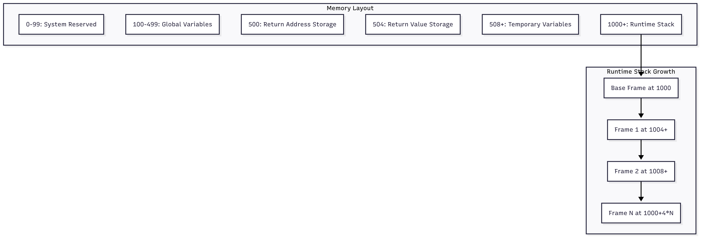
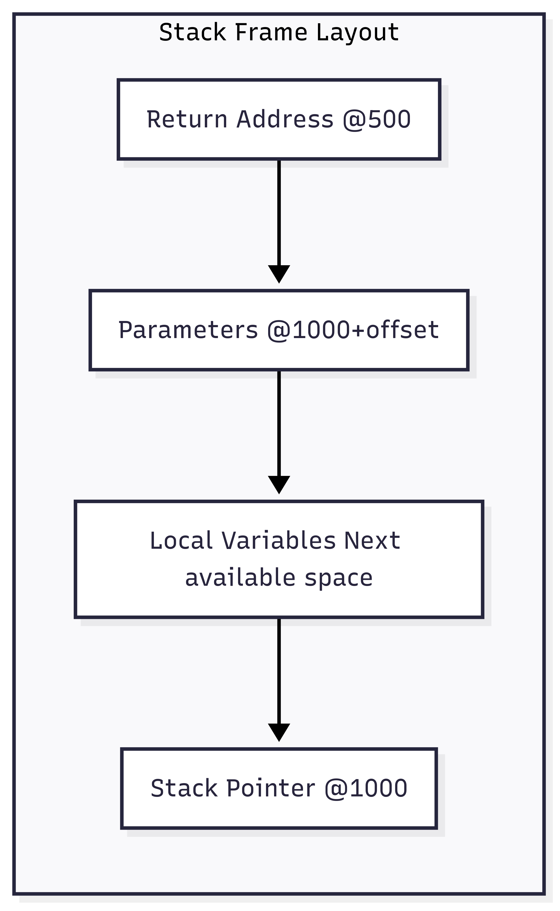
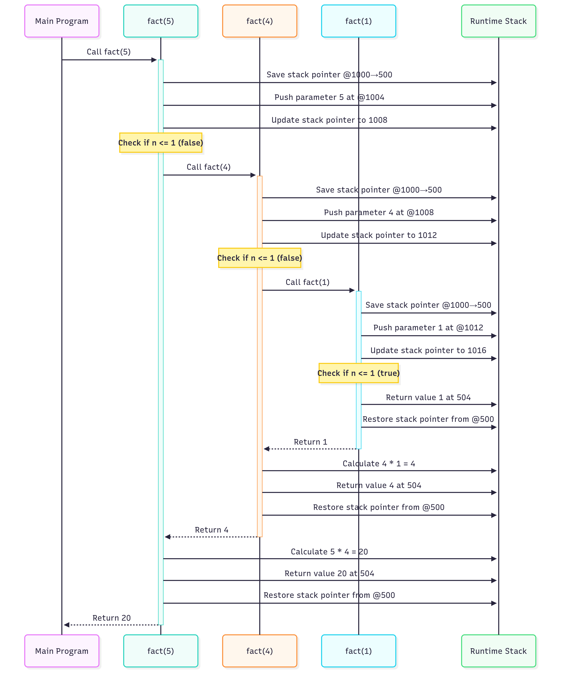
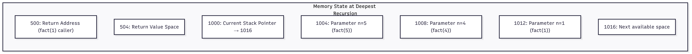

# Handling Recursive Programs in Intermediate Code Generation

## Overview

This document explains how the intermediate code generator handles recursive function calls, including the mechanisms for stack management, parameter passing, and return value handling that make recursion possible in the compiled code.

## Core Recursive Challenges Solved

### 1. **Stack Frame Management**
- Each recursive call needs its own memory space for parameters and local variables
- Stack frames must be dynamically allocated and properly cleaned up
- Return addresses must be preserved across multiple call levels

### 2. **Parameter Isolation**
- Parameters in recursive calls must not interfere with each other
- Each call level needs its own parameter space

### 3. **Return Value Propagation**
- Return values must be correctly passed back through the call chain
- Intermediate results must be preserved during recursive computation

## Memory Architecture for Recursion



## Stack Frame Structure

Each recursive call creates a new stack frame with the following structure:



## Recursive Call Mechanism

### Function Call Sequence

The **CALL** action in `ExpressionProcessor` implements the complete recursive call mechanism:

```python
def process_function_calls(self, action_symbol, token):
    if action_symbol == ActionSymbols.CALL:
        # Step 1: Save current stack pointer
        self.code_builder.instruction_list.append(f'(ASSIGN, @1000, 500, )')
        
        # Step 2: Copy parameters to new stack frame
        for i, arg in enumerate(reversed(args)):
            offset = 1000 + 4 * (len(args) - i)
            instruction = f'(ASSIGN, {arg}, @{offset}, )'
            self.code_builder.instruction_list.append(instruction)
        
        # Step 3: Update stack pointer for new frame
        new_sp = 1000 + 4 * (len(args) + 1)
        self.code_builder.instruction_list.append(f'(ASSIGN, #{new_sp}, 1000, )')
        
        # Step 4: Jump to function
        self.code_builder.instruction_list.append(f'(JP, {func_address}, , )')
```

### Function Return Sequence

The **RETURN_AT_THE_END_OF_FUNCTION** action handles proper stack cleanup:

```python
def execute_function_actions(self, action_symbol, token=None):
    if action_symbol == ActionSymbols.RETURN_AT_THE_END_OF_FUNCTION:
        # Restore previous stack frame
        self.code_builder.instruction_list.append('(ASSIGN, @500, 1000, )')
        # Return to caller
        self.code_builder.instruction_list.append('(JP, @500, , )')
```

## Recursive Execution Flow



## Complete Example: Recursive Factorial

### Source Code
```c
int fact(int n) {
    if (n <= 1) 
        return 1;
    return n * fact(n-1);
}

void main() {
    output(fact(5));
}
```

### Generated Intermediate Code

// Main function
(ASSIGN, #1000, 1000, )         // Initialize stack pointer

// Call fact(5)
(ASSIGN, @1000, 500, )          // Save stack pointer
(ASSIGN, #5, @1004, )           // Push parameter n=5
(ASSIGN, #1008, 1000, )         // Update stack pointer
(JP, fact_start, , )            // Jump to factorial function

// After fact returns
(PRINT, 504, , )                // output(return_value)

// Factorial function
fact_start:
(LE, @1004, #1, 508)           // temp = (n <= 1)
(JPF, 508, recursive_case, )    // if not base case, go to recursive

// Base case: return 1
(ASSIGN, #1, 504, )             // return 1
(ASSIGN, @500, 1000, )          // restore stack pointer
(JP, @500, , )                  // return to caller

// Recursive case
recursive_case:
(SUB, @1004, #1, 509)          // temp = n - 1
(ASSIGN, @1000, 500, )          // save current stack pointer
(ASSIGN, 509, @1008, )          // push (n-1) as parameter
(ASSIGN, #1012, 1000, )         // update stack pointer
(JP, fact_start, , )            // recursive call
(MULT, @1004, 504, 510)         // temp = n * fact(n-1)
(ASSIGN, 510, 504, )            // set return value
(ASSIGN, @500, 1000, )          // restore stack pointer
(JP, @500, , )                  // return to caller


## Stack State Visualization

### During fact(5) → fact(4) → fact(1) Execution



## Key Implementation Features

### 1. **Dynamic Stack Allocation**
- Stack grows upward from address 1000
- Each call level gets 4 bytes per parameter
- Stack pointer maintained at address 1000

### 2. **Parameter Passing Strategy**
```python
# Parameters are copied to stack positions relative to current stack pointer
offset = 1000 + 4 * parameter_index
instruction = f'(ASSIGN, {parameter_value}, @{offset}, )'
```

### 3. **Return Value Handling**
```python
# Return values are stored at fixed location 504
def handle_function_result(self):
    if self.operand_stack and self.operand_stack[-1] == '@1000':
        self.operand_stack[-1] = 504  # Standard return location
```

### 4. **Stack Frame Cleanup**
- Return address stored at 500 before each call
- Stack pointer restored from 500 on return
- Automatic cleanup ensures no memory leaks

## Benefits of This Approach

1. **Unlimited Recursion Depth**: Limited only by runtime memory, not compilation constraints
2. **Parameter Isolation**: Each recursive level has independent parameter space
3. **Type Safety**: Type checking maintained across all recursion levels
4. **Tail Recursion Ready**: Structure supports future tail recursion optimization
5. **Standard Calling Convention**: Compatible with non-recursive function calls

## Error Handling

The system includes semantic validation for recursive scenarios:
- **Stack Overflow Detection**: Can be added at runtime level
- **Type Consistency**: Ensures recursive calls maintain proper types
- **Return Value Validation**: Checks that all code paths return appropriate values

This recursive handling mechanism ensures that the intermediate code generator can compile any recursive program correctly, producing efficient three-address code that maintains proper execution semantics.